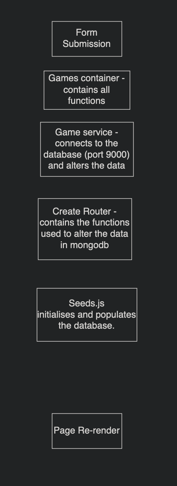

Questions

1) The create_router.js file is responsible for defining the routes of the games resource. ???

2) The client folder is responsible for the front end all the the interaction. The server is responsible for the database and the handling of the data.

3) server.js tell the app the listen to port 9000 to get the information from the database. ??? pretty sure this is wrong andn relevent to the next question, not this one.

4) ???

5) the games service file takes the information from the database and then can either post or delete the information, updating the database.

6) The second argument takes in a method and data to be passed through. It is used here to define post or delete, where post takes in json information.

7) the games api routes 'consume' the localhost:9000/api/games route. ???

8) the mongodb driver allows node applications to connect to and work with data in mongodb. ?????

